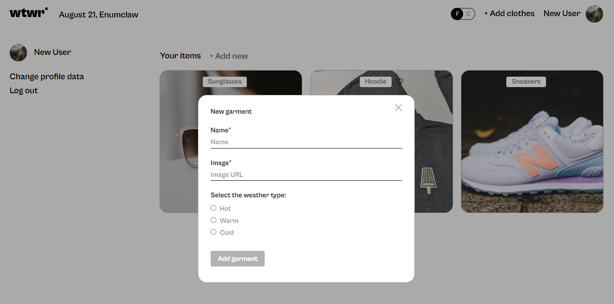
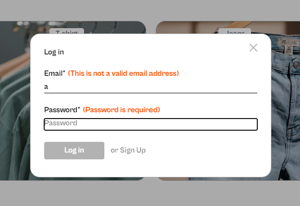

# What to Wear (WTWR)

## Project overview

This full-stack development project was completed for the Software Engineering program at TripleTen. WTWR is a desktop application that integrates weather data from an external API to provide personalized clothing recommendations based on current weather conditions.

The development process involved multiple stages, including:

- Implementation of provided UI/UX design from Figma
- Full-stack architecture design and development
- Integration of weather API
- Implementation of user authentication on both client and server sides
- Testing and debugging
- Deployment

## Key features

- Real-time Weather Integration: Utilizes a weather API to fetch current weather data.
- Personalized Clothing Recommendations: Suggests appropriate attire based on current weather conditions and user-defined clothing items.
- User Authentication: Implements secure login functionality on both front-end and server-side.

## Technologies used

- React
- MongoDB
- Express
- Node.js
- RESTful API integration
- CSS

## Back-end project link

[Github repo] (https://github.com/lisaatea/se_project_express.git)

## Webpage link

[Domain name](https://wtwr.dockl.com/)
