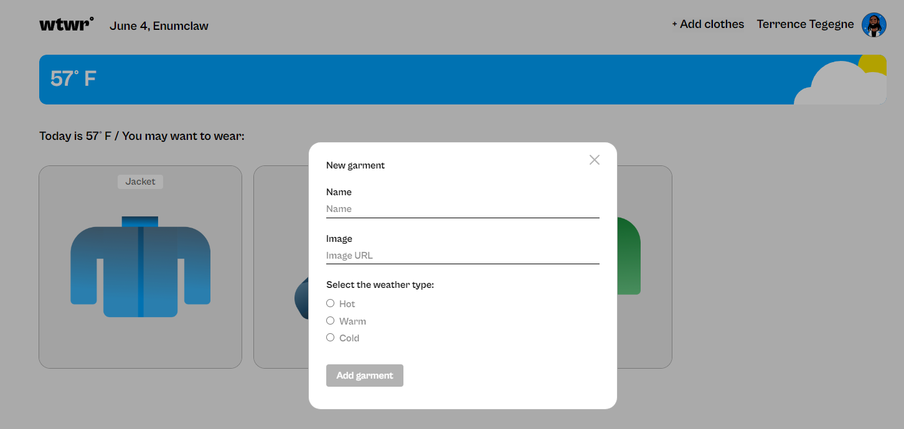

# WTWR (What to Wear)

A front-end development project completed for the Software Engineering program at TripleTen. This application reads weather data from a weather API and recommends clothing options based on the data received.

## Technologies used

- React
- API requests
- Figma
- CSS

## Project updates

This project will be built upon as the program progresses, incorporating course learnings to increase functionality with the eventual goal of creating a full-stack application.
